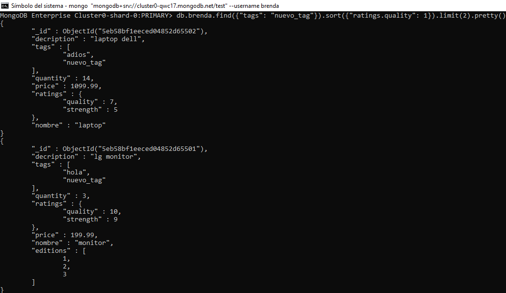
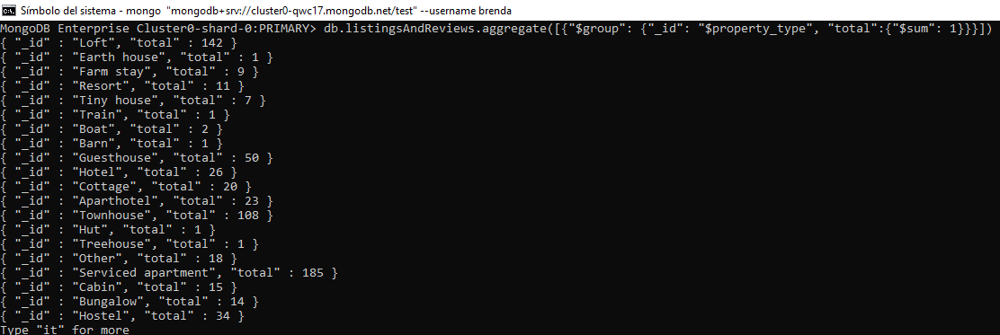
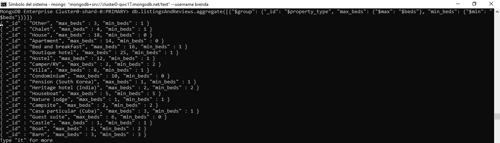

---

---

<ul>
<li><a href="#first-steps">First steps</a></li>
<li><a href="#add-information">Add information</a></li>
<li><a href="#find-information">Find information</a></li>
<li><a href="#updating-information">Updating information</a></li>
<li><a href="#aggregation-framework">Aggregation framework</a></li>
<li><a href="#delete-data">Delete data</a></li>
</ul>
<h1 id="first-steps">First steps</h1>

<code>show dbs</code>: displays the list of available databases

<code>db</code>: shows the current database

<code>use new_dbs</code>: create a new database. If we run the “show dbs” command again in theory the new database created should appear in the list, however when I run <code>use + 'database name'</code> I am saying that I am going to use that database but mongodb will not create it until we insert data into this database.

<h1 id="add-information">Add information</h1>

<code>db.createCollection("name")</code>: create collections without passing values. As you can see in the picture above, after running this command mongodb prints a message. This message means that the collection was successfully created.

<code>show collections</code>: This command will show all the collections contained in the database.

And if we run the command <code>show dbs</code> again, now we can see that our database called “new_dbs” was sucessfully created.

Another way to create a collection is by inserting values directly as shown below.

<pre><code>db.products.insert({"name": "laptop"})
</code></pre>

I don’t have any collection with this name, however, mongodb will create it and will add this document.

<h2 id="add-documents">Add documents</h2>

To add documents to a collection the following syntax must be followed. As you can see, it is similar to a json document or a dictionary in python. Moreover, the value of a field can also be a document, as shown in the field “ratings” whose structure is also similar to a json/dictionary. In addition, as shown in the field “tags” the value of a field can also be set as an array(list).

<pre><code>db.products.insert([
	{
		"name": "keyboard",
		"decription": "logitech keyboard",
		"tags": ["computers", "gaming"],
		"quantity": 3,
		"created_at": new Date(),
		"ratings" : {
                "quality" : 10,
                "strength" : 9
		}
	}
])
</code></pre>
<h1 id="find-information">Find information</h1>

<code>db.products.find()</code>: this command will display all the documents contained in the collection products. We have to make sure that the collection we are passing to this command is within the database we are currently using due to if there is no collection with this name in our database, then nothing will be print.

The output format is not very friendly, in fact, it is quite hard to understand. Mongodb provides a command called <code>.pretty()</code> which helps to have an output with a better understanding.

You can also find specific documents by passing some arguments to the operator <code>.find()</code>. Here is an example:

<h2 id="searching-by-parameters">Searching by parameters</h2>
<pre><code>db.products.find({"name": mouse})
</code></pre>

You have to pass the arguments as a dictionary, where the <em>key</em> is the field where mongodb will look up, and the <em>value</em> is the element which must be found.

Mongodb also allows users to find a group of documents. The only requirement is that these documents must have a value of a field in common. Let’s say I want to see all the documents in the current database with the tag “computers”, then I need to run the following command:

<pre><code>db.products.find({"tags": "computers"}).pretty()
</code></pre>

However, we can be more specific. We can look for a specific product with the tag “computers”. Let’s say that besides the products with this tag, I also want to see the information of the product with name “monitor” or I want to see if there is a product in the group of “computers” with this name.

<pre><code>db.products.find({"tags": "computers", "name": "monitor"}).pretty()
</code></pre>

Mongodb also has a method called <code>.findOne()</code>. Let’s imagine that we want to find, again, the group of products with the tag “computers” but by implementing the method <code>.findOne()</code>.

<pre><code>db.products.findOne({"tags": "computers"}).pretty()
</code></pre>

We can also find for specific information of a document. Let’s say we want to know just the name and description of all documents with the tag “computers”. To do that me must pass an “extra” dictionary to the method <code>.find()</code> with the fields we want to see as shown in the example above:

<h2 id="search-for-specific-information">Search for specific information</h2>
<pre><code>db.products.find({"tags": "computers"}, {"name": 1, "description": 1}).pretty()
</code></pre>

In the first part of the picture below we can see that the output is from the command above. However, in the second part we have an extra operation, we have set <code>"_id": false</code>. In these kind of operations we cannot pass false statements to the second dictionary because we will have an error, the only statement = <em>false</em> can be the id, the rest if the fields must be all 1 or <em>true</em>, but if you don’t want to see that field, then you must not inlcude that on the code.

The following line of code is definitely going to fail because the field quantity is set as false.

<pre><code>db.products.find({"tags": "computers"}, {"name": 1, "description": 1, "quantity": 0}).pretty()
</code></pre>

Here is another example which applies to all documents from the database:

<pre><code>db.products.find({}, {"nombre": 1, "price": 1, "_id": 0})
</code></pre>

<h2 id="sort-limit-and-skip-searches">Sort, limit and skip searches</h2>

Mongodb allows to sort the output when searching for a document or a set of documents. In the following image, the output was sort by name of each product and in alphabetical order. First, the documents with the tag “computers” were found, and then we can see that each document was printed in alphabetical order.

<pre><code>db.products.find({"tags": "computers"}).sort({name: 1}).pretty()

</code></pre>

We are also allowed to restrict the amount of documents we want to see when performing a search process:

<pre><code>db.products.find().limit(2).pretty()
</code></pre>

Here I decided to only see the information of 2 documents out of the total amount contained in the collection. Despite I did not specified which documents I wanted to see, mongodb will print the first <em>n</em> numbers by default, where <em>n</em> is the integer provided to the operator <code>.limit()</code>

There is another command named <code>.skip()</code> which receives a parameter <em>n</em>. This command, as its name indicates, skips <em>n</em> amount of documents and will print the rest of them, this is, it will print all the documents after the first n documents.

In the image above you can see that the first two products are a mouser and a monitor. But in the image below we can see that those two products were skipped and we have all the other documents as output.

<pre><code>db.products.find().skip(2).pretty()
</code></pre>

If we want to know the amount of documents in a collection, the command <code>.count()</code> is very useful. It will return an integer which represents the amount of documents contained in the collection, but if we want to know, let’s say, the amount of documents with the tag “juegos” then the syntax is this:

<pre><code>db.products.find({"tags": "juegos"}).count()
</code></pre>

<h2 id="perform-deeper-searches">Perform deeper searches</h2>

Remeber that we have a product which looks like this:

<pre><code>db.products.insert([
	{
		"name": "keyboard",
		"decription": "logitech keyboard",
		"tags": ["computers", "gaming"],
		"quantity": 3,
		"created_at": new Date(),
		"ratings" : {
                "quality" : 10,
                "strength" : 9
		}
	}
])
</code></pre>

We can see that in the field “ratings” also have a document as value (information). Imagine we want to find this product by its quality.

<pre><code>db.products.find({"quality": 10}).pretty()
</code></pre>

If we try the command above, nothing will be returned because there is no field named “quality”. To do the operation purposed, first we must have access to the field “ratings” and then, we can choose whether to find the product by its quality or by its strength.

<pre><code>db.products.find({"ratings.quality": 10}).pretty()
</code></pre>

Of course there are countless of ways to combine and execute many commands we have seen until now. Here is an example, however, I encourage you to keep practicing:

<pre><code>db.brenda.find({"tags": "nuevo_tag"}).sort({"ratings.quality": 1}).limit(2).pretty()
</code></pre>

This line of code will find all the products with the tag “nuevo_tag”, then, mongodb will sort these products by its quality in ascending order (1 means ascending, -1 means descending) but first it will access to the field ratings from which the attribute quality is part of. After the documents had been sorted, with <code>.limit(2)</code> We are indicating that we only want the first 2 documents.

With mongodb We can also use comparison query operators to match documents based on the comparison of a specified value. The main operator here is <code>$elemMatch</code> and now we’ll see some examples:

<pre><code>db.products.find({"editions": {"$elemMatch": {"$gt": 2}}}).pretty()
</code></pre>

Mongodb will access to the array “editions” and with <code>$elemMatch</code> method and its operator <code>$gt</code>, it will print those documents with editions grather than 2.

We can also pass two conditions. In this case I want those products with editions from 2 up to 3. The opeartor $lte stands for less than or equal to.

<code>db.products.find({"editions": {"$elemMatch": {"$gt": 2, "$lte": 3}}}).pretty()</code>

In the image there is one product that must not be there. So, what happened? What mongodb does is that if it finds at leat one element that matches the conditions specified, then it will return the information of that document.

We can also operate with no need to include the opearator <code>$elemMatch</code>. Here is an example, where <code>$gte</code> stands for greater than or equal to.

<code>db.products.find({"editions": {"$gte":5}}).pretty()</code>

Here is a list of operators of comparisson:

<table>
<thead>
<tr>
<th>operator</th>
<th></th>
</tr>
</thead>
<tbody>
<tr>
<td>$gt</td>
<td>greater than</td>
</tr>
<tr>
<td>$gte</td>
<td>greater than or equal to</td>
</tr>
<tr>
<td>$ne</td>
<td>not equal to</td>
</tr>
<tr>
<td>$lt</td>
<td>less than</td>
</tr>
<tr>
<td>$lte</td>
<td>less than or equal to</td>
</tr>
</tbody>
</table><h1 id="updating-information">updating information</h1>
<h2 id="update">.update()</h2>

Once we have input some documents to our collection, we can also update the information within each one of them. The operator <code>.update()</code> helps us to perform these changes. Let’s see a simple example of how it works:

Let’s say that I want to add the price of the product <strong>mouse</strong>. Then, the syntax to use <code>.update()</code> should be like this:

<pre><code>db.products.update({"name": "mouse"}, {"price": 99.99})
</code></pre>

The <code>.update ()</code> command has two parts. The first part searches for the product to be modified, and the second modifies the products in the specified attribute. The problem is that what is placed inside the second part will be the replacement of the whole document. Therefore, if I have 5 attributes, once this command has been ran, the product will only have the field “price”.

One way to solve this problem is by adding the <strong>new</strong> information you want the document to have + provide to the command <code>.update()</code> the existing information and in that way we can have the full information.

<pre><code>db.products.update({"price": 90.99}, {"name": "keyboard", "price": 90.99})
</code></pre>

Although the first problem was solved, it is highly inefficient due to it would be necessary to pass all the fields from the product, which would represent another problem if we have a document with many attributes.

By adding this symbol $ to the command <code>.update()</code> all our problems must be solved. What this symbol does is that it adds a new field to the existing document instead of replacing all the information.

<code>db.products.update({"name": "xiaomi redmi"}, {"$set" : {"price" : 210.99}})</code>

This action can also be done to multiple documents at the same time as shown in the following line of code:

<pre><code>db.products.update({"tags": "computers"}, {"$set" : {"price" : 1.99}}, {"multi": true})
</code></pre>

Mongodb allows to increase/decrease numerical values of a field. The operator <code>$inc</code> helps us to do this operation. Let’s see an example:

<pre><code>db.products.update({"name": "keyboard"}, {"$inc": {"price": 0.01}})
</code></pre>

Mongo will find the product with name “keyboard” and then it will increase its price by 0.01 cent.

But are also allowed to decrease a numerical value:

<pre><code>db.products.update({"name": "keyboard"}, {"$inc": {"price": -0.05}})
</code></pre>

Another advantage of this operator is that it can make changes to multiple documents at the same time. As shown in previous examples, we only need to set the option “multi” as <em>true</em>.

<pre><code>db.products.update({"tags": "gaming"}, {"$inc": {"price": 1}}, {"multi": true})
</code></pre>

Until now we have seen how to make changes to values of different fields, but mongodb also support changes to the fields themselves with the operator <code>$rename</code>:

<pre><code>db.products.update({"name": "xiaomi redmi"}, {"$rename": {"name": "nombre"}})
</code></pre>

And the field “name” from the products “xiaomi redmi” was updated to “nombre”.

As seen in past examples with different operators, with this command we can also make multiple changes at the same time:

<pre><code>db.products.update({"tags": "computers"}, {"$rename": {"name": "nombre"}}, {"multi": true})
</code></pre>

Products with the tag “computers” were found and its field with the value “name” were modified to “nombre”.

We can also delete fields from documents thanks to the operator <code>$unset</code> and it can work too with multiple documents at the same time:

<pre><code>db.products.update({"tags": "computers"}, {"$unset": {"created_at": ""}}, {"multi": true})
</code></pre>

As in previous examples, products with the tag “computers” were found and then, the field “created_at” was deleted. How? we only need to leave empty the “new” value of the field specified.

There is another operand named <code>upsert</code>. The upsert method allows somehow to “modify” an attribute of a non-existent product in the collection. When this value is not found, it adds it with the attributes that were specified

<pre><code>db.products.update({"name": "airpods"}, {$set: {"description": "apple airpods"}}, {upsert: true})
</code></pre>

<h2 id="deeper-updates">Deeper updates</h2>

We have seen how to perform “deeper searches”, now we will see how to perform “deeper updates”. Basically, the syntax has the same essence: we must have access first to the main field so we can work with the following values:

<pre><code>db.products.upadte({"tags": "computers}, {"$set: {"tags.0": "computacion"}}, {"multi": true})
</code></pre>

Here we specified that, from all the documents which contains the tag “computers”, we wanted to change the first value of the array “tags” from “computers” to “computacion”. 

Furthermore, we can also make these kind of updated with no need to specify the position of the value which must be updated:

<pre><code>db.products.upadte({"tags": "gaming}, {"$set: {"tags.$": "juegos"}}, {"multi": true})
</code></pre>

This line of code is similar to the last example. First products with the tag “gaming” were found, and then we let mongodb know that it must change the tag “gaming” to “juegos”, but due to we don’t know the position of that value, we had to put the symbol “$” to let it know that it does not matter the positions, it must change that value.

Many of the updates methods we have seen so far are excelent tools to perform changes in our documents. However, there is a problem with these methods, if I run the exact same method more than once to a same document, I will have repeated values which, in some cases, can be difficult to manage. Nevertheless, mongodb provides an operator which help us to avoid this situation. <code>$addToSet</code> will add the values specified to it if and only if, these values are not part of a field in a document already. Let’s see an example:

<pre><code>db.products.update({"tags": "computation"}, {"$addToSet": {"tags": "computacion"}}, {"multi": true})
</code></pre>

The message that mongodb is printing says that notwithstanding that 3 documents with the tag “computacion” were found, no updates were made because this value already exist in that field in all of the documents found.

Let’s see its behaviour with new values:

<pre><code>db.products.update({"tags": "computation"}, {"$addToSet": {"tags": "new_tag"}}, {"multi": true})
</code></pre>

We can see that of the 3 documents that were found, the 3 of them were updated because there was no value “new_tag” in the array tags.

It exist another method to update information named <code>$push</code>. This operator will add the value you want to input but it will be added always at the last index.

<pre><code>db.products.update({"tags": "juegos"}, {"$push": {"tags": "nuevo"}}, {"multi": true})
</code></pre>

Also we have the $pull operator. $pull will remove any instance of a value from an array with no need to specify the position which must be updated, or to specify that we don’t care about the position as shown is section “deeper updates”.

<pre><code>db.products.update({"tags": "juegos"}, {"$pull": {"tags": "nuevo"}}, {"multi": true})
</code></pre>

<h1 id="aggregation-framework">Aggregation framework</h1>

This framework allows for advanced computations. First I want to exemplify how to group data by implementing the aggregation framework.

The <code>.aggregate()</code> command takes operators as parameters. The <code>$group</code> operator, as its name indicates, it is used to group data by any specified field. Field names that begin with a “$” are called "field paths” and are links to a field in a document.

<pre><code>db.brenda.aggregate([{"$group": {"_id": "$vendor_id"}}])
</code></pre>

The code above will group the documents by the field “$vendor_id” and will return result object containing the unique vendors in the collection.

Anything specified after the group key is considered an accumulator. Accumulators take a expression and compute the expression for grouped documents.

In this case, the <code>$group</code>operand will find each unique id for the “vendor_id” field in every document, and everytime it finds the same id, it will add 1 for each matching document. The final output it is the id of each vendor and the total number of documents per vendor.

<pre><code>db.brenda.aggregate([{"$group": {"_id": "$vendor_id", "total": {"$sum": 1}}}])
</code></pre>

Here is another example of the same line of code as the shown above but this one was tried with a database from Airbnb. The <code>$group</code> operand will find each type of property (according to airbnb classification) in every document, and everytime it finds the same type of property, it will add 1 for each matching document.The final output it is the type of property and the total number of documents found per type of property.

As you can see, there is a final message which says: ‘Type it for more’.This is because When there are more than 20 documents, mongodb will iterate through them 20 at a time.

<pre><code>db.listingsAndReviews.aggregate([{"$group": {"_id": "$property_type", "total": {"$sum": 1}}}])
</code></pre>

Here is another example of the <code>$group</code> command. As the example above, it will do the exact the same thing but now, our output is sorted in descending order and it will just print the first five documents.

<pre><code>db.listingsAndReviews.aggregate([{"$group": {"_id": "$property_type", "total": {"$sum": 1}}}, {"$sort": {"total": -1}}, {"limit": 5}])
</code></pre>

This is another example which calculates the average of rooms per type of property.

<pre><code>db.listingsAndReviews.aggregate([{"$group": {"_id": "$property_type", "average_rooms": {"$avg": "$bedrooms"}}}])
</code></pre>

Here we have the max amount of bedrooms per type of property.

<pre><code>db.listingsAndReviews.aggregate([{"$group": {"_id": "$property_type", "max_bedrooms": {"$max": "$bedrooms"}}}])
</code></pre>

Here we obtained the max and min amount of beds per type of property.

<pre><code>db.listingsAndReviews.aggregate([{"$group": {"_id": "$property_type", "max_beds": {"$max": "$beds"}, "min_beds": {"$min": "$beds"}}}])
</code></pre>

If we want to pass multiple methods to an aggregate function, this is the structure that must be followed. As you can see, each method is independent from each other,

<pre><code>db.listingsAndReviews.aggregate([
	{"$group": {"_id": "$property_type", "max_beds": {"$max": "$beds"}, "min_beds": {"$min": "$beds"}}},
	{"$sort": {"property_type": -1}},
	{"$limit": 3}
])
</code></pre>
<h1 id="delete-data">Delete data</h1>

The document wit the name “keyboard” was deleted from the collection.

<pre><code>db.products.remove({"nombre": "keyboard"})
</code></pre>

Likewise, it is possible to delete documents with very very specific parameters. We can see that some documents in the collection have an attribute called “ratings”.

By running this line of code documents with quality = 10 in the ratings attributes were deleted and now we only have two documents.

<pre><code>db.brenda.remove({"ratings.quality": 10})
</code></pre>

<code>db.brenda.remove({})</code>: If we don’t pass any specification to the remove method, then it will remove all documents from the collection. And we can prove it by running the command <code>find()</code> or <code>count()</code>.

